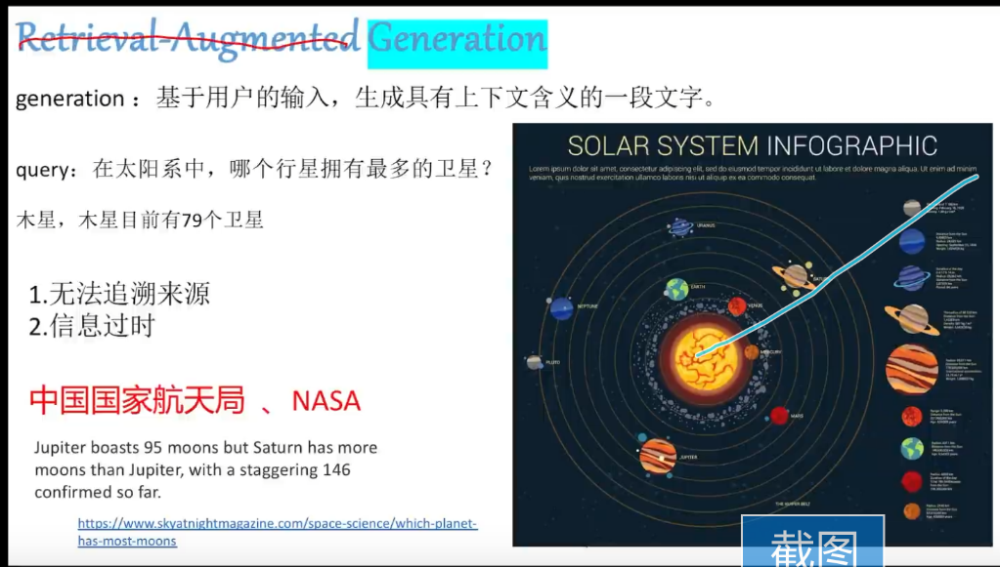

# RAG_langchain

介绍如何利用langchain快速实现RAG

# 快速上手

你可以通过运行[rag_chat](https://github.com/blackinkkkxi/RAG_langchain/blob/main/rag_chat.ipynb)快速实现一个基于 `openai`的 `RAG`系统

[b站链接 ](https://www.bilibili.com/video/BV1bi4y1v729/?spm_id_from=333.999.0.0&vd_source=dc270b03c3087e0ef2f4f8474d52b5d6)

# 推荐学习路线

1.[pdf_loader](https://github.com/blackinkkkxi/RAG_langchain/tree/main/learn/doc_loader)
2.[text_splitter](https://github.com/blackinkkkxi/RAG_langchain/tree/main/learn/text_splitter)
3.[embedding_model](https://github.com/blackinkkkxi/RAG_langchain/tree/main/learn/embedding_model)

# 我想要的目的

- github和vscode同步：在本地改了，怎么上传到github上？
  - 用GitHub Desktop
- 用vscode编辑md，图片的保存位置
  - 下载了一个vscode的插件typora，显示的时候挺好的。他会自动创建一个image的文件夹来放图片。但是图片有点太大吧
  - 
  - [vscode-office/README-CN.md at d12b9ac84a706771f0876df3b95b3a1da6866cf6 · cweijan/vscode-office (github.com)](https://github.com/cweijan/vscode-office/blob/HEAD/README-CN.md)添加一个链接试试
  -
